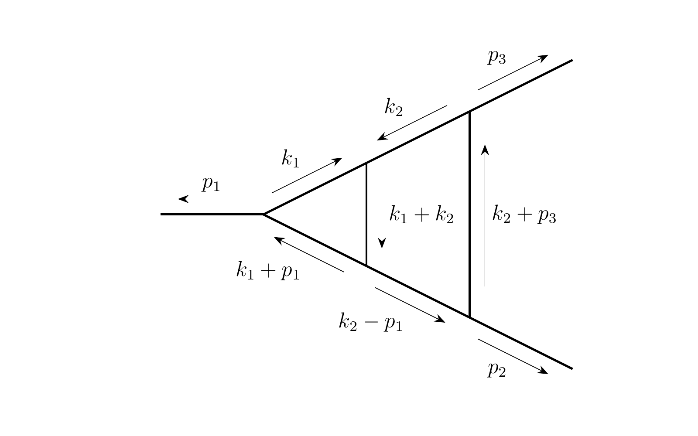

# ML-Guided IBP Reduction
## Neural Network Guided Integration-by-Parts Reduction of Feynman Integrals
### Two-Loop Triangle-Box Topology

---

# The Problem

- **IBP reduction**: Express complex Feynman integrals as linear combinations of simpler "master" integrals
- **Challenge**: Exponential search space of IBP identities
- **Traditional approaches**: Laporta algorithm, Kira, FIRE

---

# Triangle-Box Topology

{height=70%}

*Two-loop integral with 6 propagators + 1 ISP. From arXiv:2502.05121.*

---

# Propagators and ISP

## 6 Propagators (denominators)
| $D_1 = k_1^2$ | $D_2 = k_2^2$ | $D_3 = (k_1+k_2)^2$ |
|---------------|---------------|---------------------|
| $D_4 = (k_1+p_1)^2$ | $D_5 = (k_2+p_3)^2$ | $D_6 = (k_2-p_1)^2$ |

## 1 ISP (irreducible scalar product)
$D_7 = (k_1+p_3)^2$ — needed to complete basis, appears in numerator

---

# Integral Notation

## $I[a_1, a_2, a_3, a_4, a_5, a_6, a_7]$

$$I(a_1,\ldots,a_7) = \int \frac{d^D k_1 \, d^D k_2}{\prod_{i=1}^{7} D_i^{a_i}}$$

## Index Meaning
- $a_i > 0$: **propagator** in denominator (power $a_i$)
- $a_i < 0$: **numerator** insertion (ISP to power $|a_i|$)
- $a_i = 0$: $D_i$ absent

## Example
$I[1,1,1,1,1,1,-3]$ = top sector integral with $D_7^3$ in numerator

---

# Kinematics and Masses

## External Masses
- $p_1^2 = m_1^2$, $p_2^2 = m_2^2$, $p_3^2 = m_3^2$
- Physics depends on ratios $m_2/m_1$, $m_3/m_1$

## Our Numerical Setup
- Work over **finite field** $\mathbb{F}_p$ with $p = 1009$
- Fixed random values: $d=41$, $m_1=1$, $m_2=31$, $m_3=47$
- Exact integer arithmetic (no floating point errors)

---

# IBP Identities

## Source
Integration by parts under the integral sign:
$$0 = \int d^D k_1 \, d^D k_2 \; \frac{\partial}{\partial k_l^\mu} \frac{q^\mu}{\prod_i D_i^{a_i}}$$

## For Triangle-Box
- **8 IBP operators**: 2 loop momenta × 4 vectors $\{k_1, k_2, p_1, p_2\}$
- **1 LI identity**: from Lorentz invariance
- Each identity relates integrals with shifted indices $a_i$

## Result
All integrals reduce to **16 master integrals**

---

# The Memory Wall

Traditional IBP codes hit **memory limits** as integrals grow more complex:

{height=55%}

*Kira benchmarks: Memory grows exponentially with integral weight (r), reaching 2.5+ GB for r=13.*

---

# Our Solution

- **ML-guided beam search**: Train a neural network to score IBP actions
- **Hierarchical reduction**: Process sectors from highest to lowest
- **Parallel execution**: Distribute across Condor cluster for ~10x speedup
- **Constant memory**: Each one-step reduction is independent - no system accumulation

---

# The Action Space: Key Innovation

## Why Traditional IBP is Hard
- Infinite possible IBP identities (any seed, any operator)
- No clear way to choose which identity to apply
- Laporta: build giant linear system, solve globally

## Our Approach: Finite Action Space
- Restrict to actions that **solve for a specific target integral**
- Each action = (IBP operator, seed shift)
- Enumerate only **valid actions** that eliminate the target
- Enables ML: classification over finite action set

---

# Action Representation {.shrink}

## Action = (ibp_op, delta)

- **ibp_op**: Which IBP/LI operator (0-15)
- **delta**: Shift from target to seed integral

## Example
Target: `I[2,0,1,0,1,1,0]`, Action: `(3, (-1,0,0,0,0,0,0))`

```
IBP eq (op=3, seed=[1,0,1,0,1,1,0]):
  c₁·I[2,0,1,0,1,1,0] + c₂·I[1,0,1,...] + ... = 0
       ↑ target
```
Solve for target → express in terms of simpler integrals

---

# Direct vs Indirect Actions {.shrink}

## Direct Actions
- Target appears directly in the raw IBP equation
- Straightforward: apply IBP, solve for target

## Indirect Actions (Key Innovation)
- Target does **not** appear in raw IBP equation
- But appears **after applying substitutions** from previous steps

```
Raw IBP:     c₁·I[A] + c₂·I[B] = 0   (no target)
After subs:  c₁·I[A] + c₂·(... + c₃·I[target] + ...) = 0
                               ↑ target appears!
```

Indirect actions leverage reduction history for deeper reductions

---

# Subsector Filtering {.shrink}

## The Problem
Arbitrary IBP actions can introduce integrals in **higher sectors** → explosion

## Solution: Subsector Constraint
Only allow actions where all resulting integrals are in **subsectors** of target

## Sector Hierarchy
```
Sector 63 [1,1,1,1,1,1] (6 propagators)
    ↓ subsectors
Sector 62 [0,1,1,1,1,1] (5 propagators)
Sector 61 [1,0,1,1,1,1] (5 propagators)
    ↓
  ...lower sectors...
```

**Result**: Reductions flow downward through sector hierarchy

---

# Why This Works

## Finite + Learnable
- Typically 10-100 valid actions per state
- Model learns which actions lead to successful reductions

## Hierarchical Structure
- Subsector filtering ensures monotonic progress
- Never introduces integrals harder than current target

## Substitution Chains
- Indirect actions enable multi-step reasoning
- Model implicitly learns useful substitution patterns

---

# Key Results {.shrink}

## Triangle-Box Topology (arXiv:2502.05121)

| Integral | Weight | Seq. | Par. | Speedup | Masters |
|----------|--------|------|------|---------|---------|
| `I[2,0,2,0,1,1,0]` | (6,0) | 5 min | - | - | 4 |
| `I[1,1,1,1,1,1,-3]` | (6,3) | 73 min | 12 min | 6x | 16 |
| `I[3,2,1,3,2,2,-6]` | (13,6) | **~20 hr** | **115 min** | **~10x** | 16 |

- Results match Kira exactly
- Reduces to exact 16 paper masters from arXiv:2502.05121

---

# System Architecture {.shrink}

```
┌──────────────────────────────────────────────────┐
│              Training Pipeline                    │
│  ┌──────────┐   ┌──────────┐   ┌──────────┐     │
│  │   Data   │ → │  Model   │ → │ Trained  │     │
│  │Generation│   │ Training │   │Checkpoint│     │
│  └──────────┘   └──────────┘   └──────────┘     │
└──────────────────────────────────────────────────┘
                        ↓
┌──────────────────────────────────────────────────┐
│             Inference Pipeline                    │
│  ┌──────────┐   ┌──────────┐   ┌──────────┐     │
│  │ Starting │ → │   Beam   │ → │  Master  │     │
│  │ Integral │   │  Search  │   │ Integrals│     │
│  └──────────┘   └──────────┘   └──────────┘     │
│                       ↓                          │
│         ┌────────────────────────┐               │
│         │ Condor Parallelization │               │
│         └────────────────────────┘               │
└──────────────────────────────────────────────────┘
```

---

# Part 1: Data Generation

---

# Data Generation: Two-Phase Approach

## Phase 1: Scrambling
1. Start from **random linear combination of masters**
2. Apply random IBP identities to increase complexity
3. **Record** each IBP used: `[(op₁, seed₁), (op₂, seed₂), ...]`
4. Only use IBPs that stay within target sector (no higher sectors)

## Phase 2: Unscrambling (Oracle)
Replay the scramble in reverse to generate training samples

---

# Unscrambling: Step by Step

## At each step:
1. Find **target** = highest-weight non-master in expression
2. Look up which recorded IBP can eliminate target (**oracle**)
3. Enumerate **all valid actions** that could eliminate target
4. Record training sample: `(expr, target, valid_actions, oracle_choice)`
5. Apply action: add `target → solution` to substitutions
6. Repeat until only masters remain

## Key: Oracle provides perfect labels
- No expensive search needed — answer comes from scramble record
- Model learns to predict oracle's choice among valid alternatives

---

# Data Generation: Coverage

## Sector Coverage
- All 63 non-trivial sectors covered
- Uses 16 paper masters for their respective sectors
- Uses corner integrals for remaining sectors

## Dataset Statistics
| Split | Samples | Size |
|-------|---------|------|
| Train | 946,168 | 3.8 GB |
| Validation | 118,271 | 480 MB |
| Test | ~118,000 | 480 MB |

---

# Data Format {.shrink}

Each training sample contains:

```python
{
    'sector_mask': [1,0,1,0,1,1],  # 6-bit sector encoding
    'expr': [                      # Current expression
        ([1,0,2,0,1,1,0], 107),    # (integral, coefficient)
        ([1,0,1,0,1,1,0], 303),
        ...
    ],
    'subs': [                      # Substitution history
        (key_integral, [(repl_int1, coeff1), ...]),
        ...
    ],
    'target_integral': [1,0,2,0,1,1,0],  # Integral to eliminate
    'valid_actions': [(ibp_op, delta), ...],
    'label': 3  # Index of correct action
}
```

---

# Part 2: Model Architecture

---

# Model: IBPActionClassifierV5

## Overview
- **Task**: Score candidate IBP actions given current reduction state
- **Architecture**: Transformer-based with specialized encoders
- **Parameters**: 7.7M
- **Best validation accuracy**: 90.77%

## Key Innovation (V5)
Full substitution encoding - encode not just the key integral but the complete replacement expression

---

# Model Architecture Diagram {.shrink}

```
Inputs: Expression, Target, Substitutions, Sector, Actions
                              │
         ┌────────────────────┴────────────────────┐
         ▼                                          ▼
┌─────────────────────┐                ┌─────────────────────┐
│  Expression Encoder │                │ Substitution Encoder│
│  2-layer Transformer│                │  2-layer Transformer│
└──────────┬──────────┘                └──────────┬──────────┘
           │       ┌─────────────────┐            │
           │       │  Sector Encoder │            │
           │       └────────┬────────┘            │
           └────────────────┼─────────────────────┘
                            ▼
                 ┌─────────────────────┐
                 │    State Combine    │
                 │   (4×256 → 256)     │
                 └──────────┬──────────┘
                            ▼
                 ┌─────────────────────┐
                 │   Cross-Attention   │
                 │ Actions → Expr Terms│
                 └──────────┬──────────┘
                            ▼
                      Action Scores
```

---

# Component Details {.shrink}

| Component | Purpose |
|-----------|---------|
| **Expression Encoder** | Encode expression + target |
| **Substitution Encoder** | Encode reduction history |
| **Sector Encoder** | Condition on sector |
| **Cross-Attention Scorer** | Score actions vs expression |

All use 2-layer architectures (Transformer or cross-attention)

## Model Hyperparameters
- Embedding dimension: 256, Attention heads: 4
- Total parameters: 7,696,709

---

# Part 3: Training

---

# Training Configuration

```python
epochs = 30
batch_size = 256
learning_rate = 0.0004
weight_decay = 1e-5
optimizer = AdamW
```

## Training Results
- **Best checkpoint**: Epoch 22
- **Validation accuracy**: 90.77% (top-1)
- **Top-5 accuracy**: ~98%
- **Training time**: ~800s per epoch on GPU

---

# Training Curves

## Key Observations
- Model converges by epoch 20-25
- Validation accuracy plateaus at ~91%
- No significant overfitting observed
- Top-5 accuracy very high (~98%) - beam search can recover from top-1 mistakes

---

# Part 4: Beam Search Inference

---

# Beam Search Algorithm

## Each Step (beam width = 20)
1. Start with **20 states** in the beam
2. For each state, identify **target** = max weight non-master
3. Model ranks valid actions; expand **top 20 actions per state**
4. This produces **~400 candidate states**
5. Sort by (max_weight, n_non_masters, -model_score)
6. Keep **top 20** → new beam

## Termination
- Stop when best state contains **only master integrals**
- Model guides *which actions to try*; weight reduction decides *what to keep*

---

# Beam Search Optimizations

## P1: Equation Caching (~3-10x speedup)
- IBP equation generation is expensive (sympy operations)
- Cache `get_raw_equation` results
- Reuse across beam states with shared history

## P2: Batched Inference (~50x speedup)
- Prepare all action candidates as numpy arrays
- Single batched forward pass through model
- Eliminates per-action inference overhead

## Combined Effect
- Per-step time: 10-90s → 0.1-5s
- Makes deep reductions feasible

---

# Hierarchical Reduction Strategy {.shrink}

## Algorithm
1. Find highest-level sector with non-master integrals
2. Run beam search to eliminate all non-masters in that sector
3. Move to next highest sector
4. Repeat until only masters remain

## Example: I[2,0,2,0,1,1,0]
| Sector | Level | Steps |
|--------|-------|-------|
| 53 | 4 | 53 |
| 52 | 3 | 17 |
| 49 | 3 | 4 |
| 37 | 3 | 42 |
| 21 | 3 | 46 |
| ... | ... | ... |
| **Total** | - | **176** |

---

# Beam Restart Strategy (V11+)

## Problem
After weight improvement, beam often contains suboptimal states that will never succeed

## Solution: Beam Restart
1. Run beam search until weight improves
2. **Stop and restart** with only the best state
3. Prunes dead ends, enables deeper exploration

## Impact
- Essential for high-weight integrals
- `I[1,1,1,1,1,1,-3]`: 1,416 steps across 45 sectors
- `I[3,2,1,3,2,2,-6]`: 46,345 steps across 62 sectors

---

# Part 5: Parallelization

---

# Parallelization Motivation

## The Bottleneck
- Sequential reduction of `I[3,2,1,3,2,2,-6]` takes ~20 hours
- Single-threaded beam search on CPU
- Many independent integrals could be processed in parallel

## Key Insight
Each one-step reduction is independent - distribute across workers!

---

# Async Parallel Architecture {.shrink}

```
┌────────────────────────────────────────────────┐
│               Main Controller                   │
│  ┌──────────┐  ┌──────────┐  ┌──────────┐     │
│  │Work Queue│  │  Cache   │  │Straggler │     │
│  │(pending) │  │(memoize) │  │Detection │     │
│  └──────────┘  └──────────┘  └──────────┘     │
└────────────────────────────────────────────────┘
                       │
        ┌──────────────┼──────────────┐
        ▼              ▼              ▼
   ┌─────────┐    ┌─────────┐    ┌─────────┐
   │Worker 1 │    │Worker 2 │    │Worker N │
   │ (1 CPU) │    │ (1 CPU) │    │ (8 CPU) │
   └─────────┘    └─────────┘    └─────────┘
        │              │              │
        └──────────────┼──────────────┘
                       ▼
                Results (pickle)
```

---

# Key Parallelization Features

## 1. Async Work Distribution
- Submit all pending non-masters immediately
- Don't wait for level synchronization
- Process results as they arrive

## 2. Memoization Cache
- Store: `integral → reduced expression`
- Avoid redundant work (~55,000 cache hits!)
- Critical when stragglers produce already-cached results

## 3. Straggler Detection
- Jobs >30 min are killed and resubmitted
- Resubmit with 8 CPUs (parallel beam search)
- Prevents slow integrals from blocking progress

---

# Parallel Performance {.shrink}

## I[3,2,1,3,2,2,-6] Results

| Metric | Value |
|--------|-------|
| Time (sequential) | ~20 hours |
| Time (parallel) | **115 minutes** |
| **Speedup** | **~10x** |
| Jobs submitted | 21,096 |
| Stragglers resubmitted | 24 |
| Cache hits | 55,075 |
| Final masters | 16 |

---

# Part 6: Results

---

# Validation Against Kira

## I[2,0,2,0,1,1,0] (Sector 53)

| Method | Masters | Result |
|--------|---------|--------|
| **Kira** | 4 | Reference |
| **Our V5** | 4 | Matches exactly |

Our reduction produces the **exact same master basis** as professional IBP software.

---

# Scaling Results {.shrink}

| Integral | Weight | Time | Steps | Masters |
|----------|--------|------|-------|---------|
| `I[2,0,2,0,1,1,0]` | (6,0) | 5 min | 176 | 4 |
| `I[1,1,1,1,1,1,-3]` | (6,3) | 12 min* | 1,416 | 16 |
| `I[3,2,1,3,2,2,-6]` | (13,6) | **115 min*** | 131,769 | 16 |

*With parallel execution

---

# Final Reduction Example {.shrink}

## I[3,2,1,3,2,2,-6] → 16 Paper Masters

```
Final expression (mod 1009):
  171 * I[1,0,1,1,1,1,0]
  854 * I[1,1,0,1,1,1,0]
  377 * I[1,1,1,1,1,0,0]
  160 * I[-1,1,1,1,1,0,0]
  100 * I[0,1,1,1,1,0,0]
  647 * I[1,-1,1,0,1,1,0]
    9 * I[1,-1,1,1,1,0,0]
  ... (16 masters total)
```

Matches arXiv:2502.05121 basis exactly!

---

# Part 7: Conclusions

---

# Key Contributions

1. **ML-guided IBP reduction** that matches professional software (Kira)
2. **Constant memory usage** - avoids the memory wall of traditional approaches
3. **Hierarchical beam search** with restart strategy for deep reductions
4. **Async parallel execution** with ~10x speedup
5. **Straggler handling** for robust distributed computing
6. **Paper-masters-only mode** for clean minimal basis

---

# Technical Innovations

## Model
- Full substitution encoding (V5)
- Cross-attention action scoring
- Target-aware expression encoding

## Inference
- Equation caching (3-10x speedup)
- Batched model inference (50x speedup)
- Beam restart strategy

## Parallelization
- Async one-step distribution
- Memoization cache (~55k hits)
- Automatic straggler resubmission

---

# Future Work

1. **GPU workers** for faster beam search
2. **Adaptive timeouts** based on sector statistics
3. **More integrals** - test on other two-loop families
4. **Training on successful paths** - use reduction results to improve model
5. **Path optimization** - shorten saved reduction paths

---

# Code Availability

**Repository**: `github.com/davidshih17/RL_IBPreduction_claude`

## Key Files
- `models/classifier_v5.py` - Model architecture
- `scripts/eval/hierarchical_reduction_async.py` - Parallel reduction
- `scripts/eval/reduce_integral_onestep_worker.py` - Condor worker
- `docs/parallelization.md` - Detailed documentation

---

# Thank You

## Questions?

### Contact
- Repository: `github.com/davidshih17/RL_IBPreduction_claude`
- arXiv: 2502.05121 (paper masters reference)
